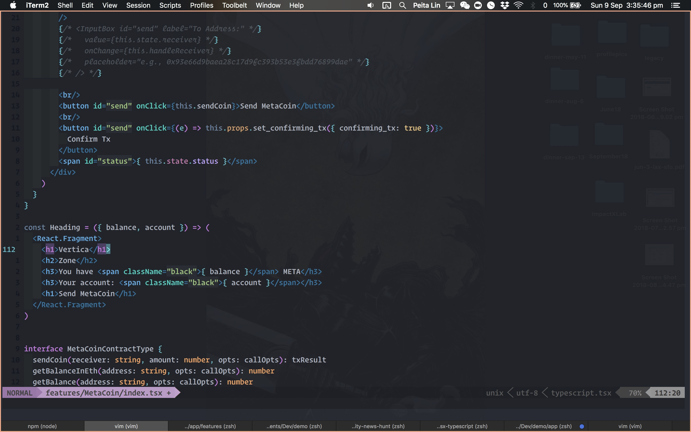
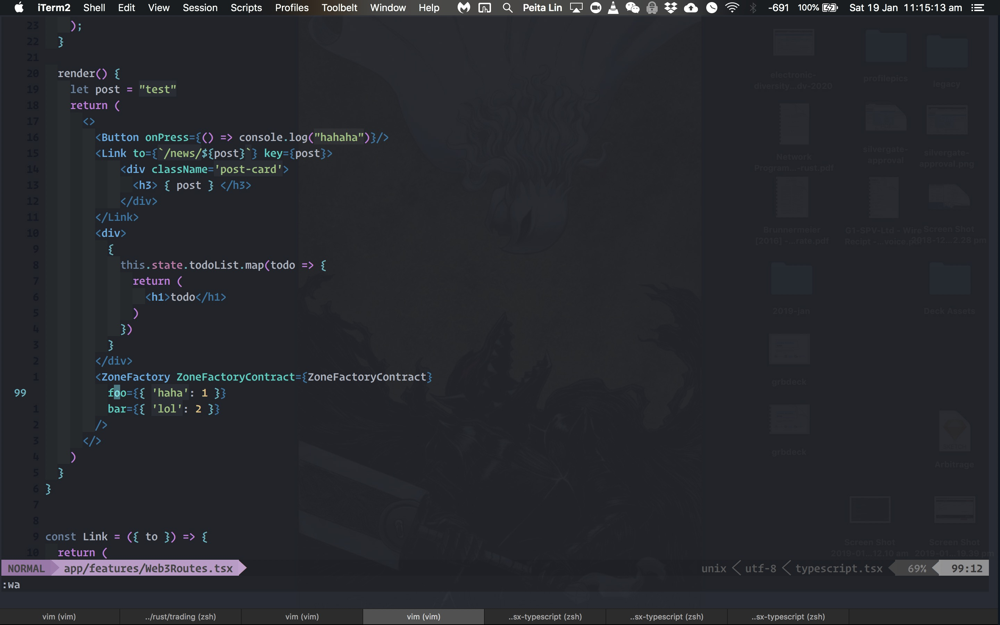
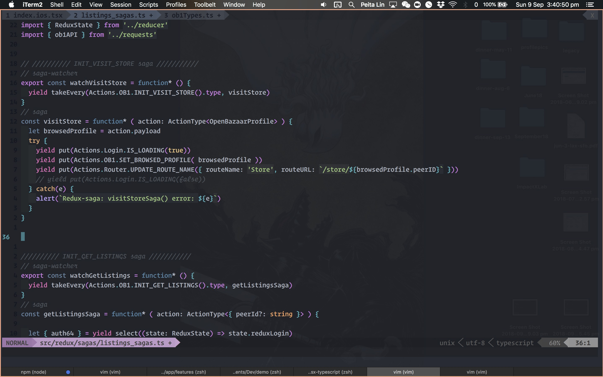

vim-jsx-typescript
=======

Syntax highlighting for JSX in Typescript.

vim-jsx-typescript is _not_ a JavaScript syntax package, so in order to use it, you will
also need to choose a base JS highlighter. [leafgarland/typescript-vim][1] is the
recommended package.






## Installation

You can also add vim-jsx using [Vundle] or junegunn/vim-plug---just add the following lines to
your `~/.vimrc`:

### Vundle:

```
Plugin 'peitalin/vim-jsx-typescript'
```

### Vim-plug:

```
Plug 'leafgarland/typescript-vim'
Plug 'peitalin/vim-jsx-typescript'
```

To install from within vim, use the commands below.
```
    :so ~/.vimrc
    :PluginInstall

OR for vim-plug:
    :PlugInstall

```

Note you can include .jsx files as typescript.tsx files for syntax highlighting.
```
" set filetypes as typescript.tsx
autocmd BufNewFile,BufRead *.tsx,*.jsx set filetype=typescript.tsx
```


Set jsx-tag colors in vimrc:
```
" light blues
hi xmlTagName guifg=#59ACE5
hi xmlTag guifg=#59ACE5

" dark blues
hi xmlEndTag guifg=#2974a1
```


