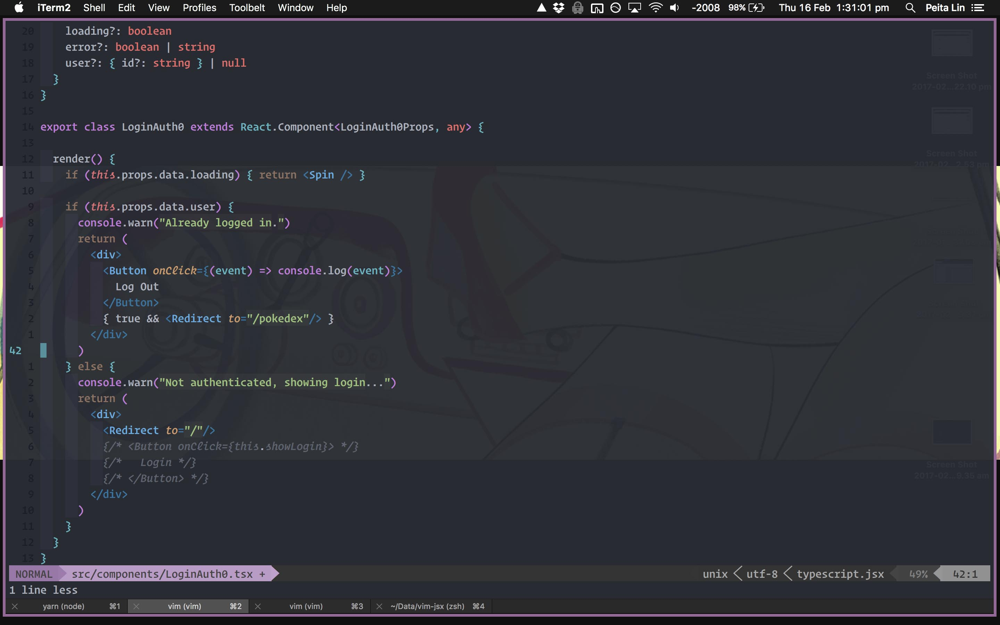

vim-jsx-typescript
=======
There is no indentation bundled with this library, so install with your bundler of choice with:

```
Plug 'leafgarland/typescript-vim'
Plug 'peitalin/vim-jsx-typescript'

" set filetypes as typescript.jsx
autocmd BufNewFile,BufRead *.tsx,*.jsx set filetype=typescript.jsx
```

You need to set .tsx files as filetype=typescript.jsx, since leafgarland/typescript-vim
sets .tsx fiels as "typescript".

Note you can include .jsx and .js files as typescript.jsx files for syntax highlighting.




Syntax highlighting and indenting for JSX in Typescript. JSX is a JavaScript syntax
transformer which translates inline XML document fragments into JavaScript
objects.

vim-jsx is _not_ a JavaScript syntax package, so in order to use it, you will
also need to choose a base JS highlighter. [leafgarland/typescript-vim][1] is the
recommended package---it is vim-jsx-typescript's "official" dependency.


Set jsx-tag colors in vimrc:
```
" light blues
hi xmlTagName guifg=#59ACE5
hi xmlTag guifg=#59ACE5

" dark blues
hi xmlEndTag guifg=#2974a1
hi htmlTag guifg=#2974a1
hi htmlEndTag guifg=#2974a1
hi htmlTagName guifg=#2974a1
```


